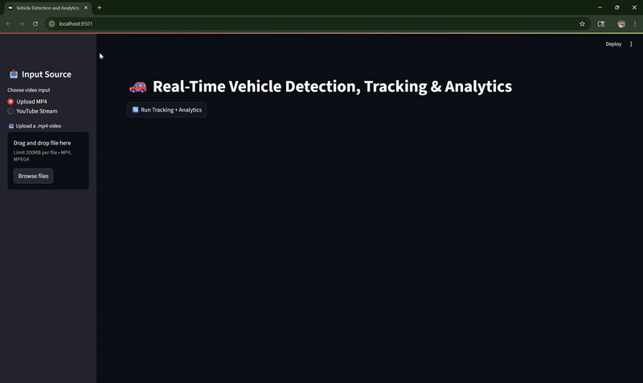
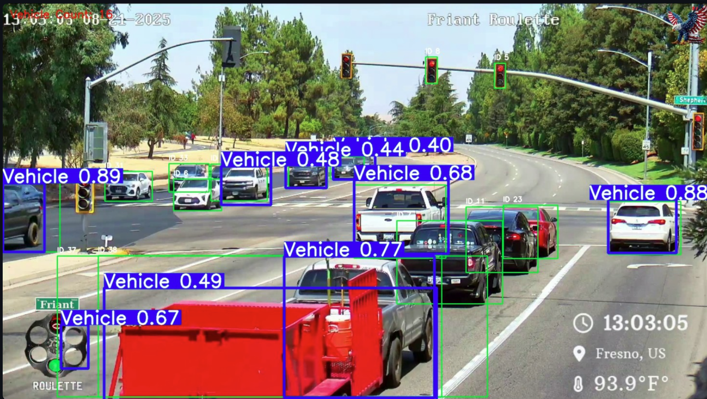
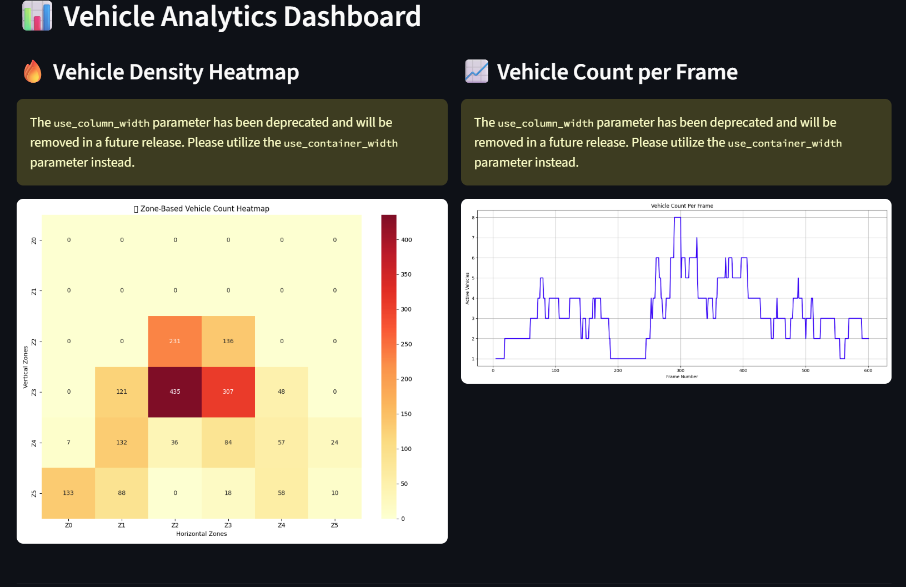
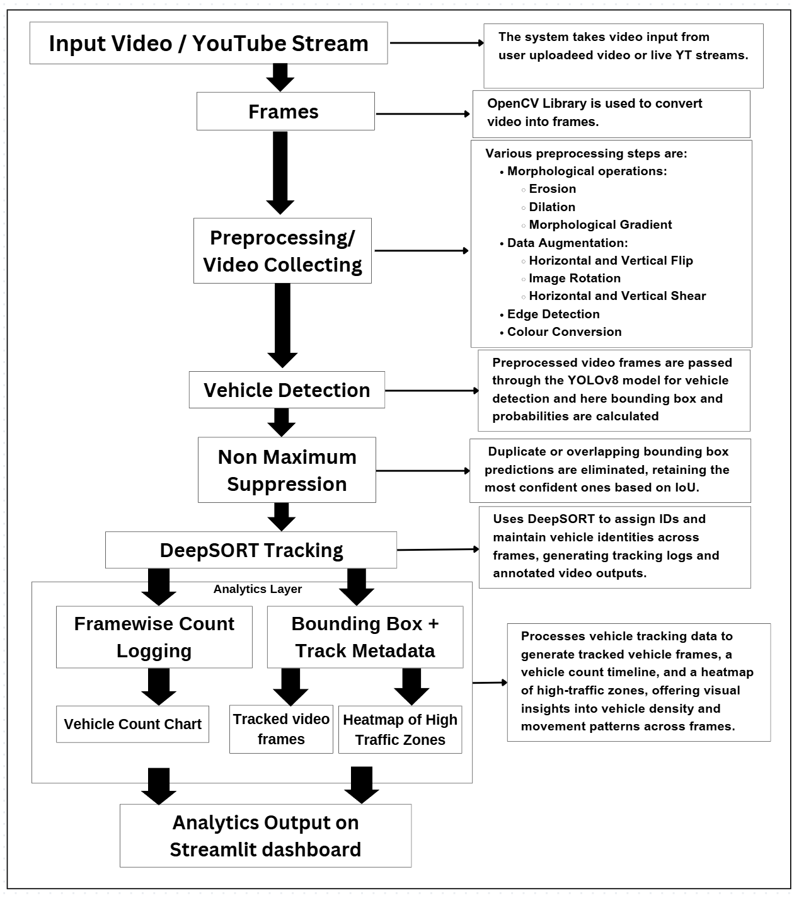
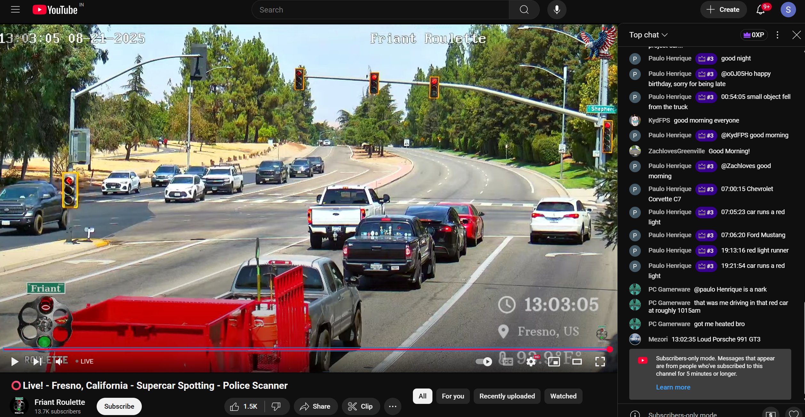

# 🚗 Vehicle Detection, Tracking & Analytics System

A comprehensive computer vision system that combines YOLOv8 object detection with DeepSORT tracking to provide real-time vehicle detection, tracking, and analytics through an intuitive Streamlit web interface.

## 📋 Table of Contents

- [Overview](#overview)
- [Features](#features)
- [Architecture](#architecture)
- [Installation](#installation)
- [Usage](#usage)
- [Project Structure](#project-structure)
- [Model Training](#model-training)
- [Analytics](#analytics)
- [API Reference](#api-reference)
- [Contributing](#contributing)
- [License](#license)

## 🎯 Overview

This project implements a state-of-the-art vehicle detection and tracking system using YOLOv8 for object detection and DeepSORT for multi-object tracking. The system provides comprehensive analytics including vehicle density heatmaps, count timelines, and real-time tracking visualization through a user-friendly Streamlit dashboard.

### Key Capabilities

- **Real-time Vehicle Detection**: YOLOv8-based detection with high accuracy
- **Multi-Object Tracking**: DeepSORT algorithm for consistent vehicle tracking
- **Interactive Dashboard**: Streamlit-based web interface for easy interaction
- **Comprehensive Analytics**: Heatmaps, timelines, and statistical analysis
- **Multiple Input Sources**: Support for uploaded videos and YouTube streams
- **Model Evaluation**: Built-in performance metrics and confusion matrices

### 🎬 Live Demo



*Interactive demonstration of the complete vehicle detection and tracking system workflow*

## ✨ Features

### 🎥 Video Processing
- **Multi-format Support**: MP4 video upload and processing
- **YouTube Integration**: Direct processing of YouTube live streams
- **Real-time Processing**: Frame-by-frame analysis with configurable parameters
- **Output Generation**: Annotated videos with bounding boxes and tracking IDs



*Example of vehicle detection and tracking with bounding boxes, confidence scores, and unique track IDs*

### 📊 Analytics Dashboard
- **Vehicle Density Heatmap**: Zone-based heatmap showing vehicle concentration areas
- **Count Timeline**: Frame-wise vehicle count visualization
- **Tracking Statistics**: Real-time metrics during video playback
- **Model Performance**: Confusion matrix and evaluation metrics display



*Comprehensive analytics interface showing vehicle density heatmaps, count timelines, and tracking statistics*

### 🔧 Technical Features
- **Non-Maximum Suppression**: Advanced NMS for improved detection accuracy
- **Overlap Filtering**: Intelligent filtering of overlapping detections
- **Area-based Filtering**: Minimum area thresholds for detection validation
- **Configurable Parameters**: Adjustable confidence thresholds and tracking parameters


## 🏗️ Architecture

### System Overview



*High-level system architecture showing the complete data flow from video input to analytics output*

The system follows a modular architecture with the following key components:

```
┌─────────────────┐    ┌─────────────────┐    ┌─────────────────┐
│   Input Video   │───▶│  YOLOv8 Model   │───▶│  DeepSORT       │
│   (MP4/YouTube) │    │   Detection     │    │   Tracker       │
└─────────────────┘    └─────────────────┘    └─────────────────┘
                                                       │
┌─────────────────┐    ┌─────────────────┐    ┌─────────────────┐
│   Analytics     │◀───│  Tracking Log   │◀───│  Bounding Boxes │
│   Generation    │    │   (CSV)         │    │   & Track IDs   │
└─────────────────┘    └─────────────────┘    └─────────────────┘
         │
┌─────────────────┐    ┌─────────────────┐    ┌─────────────────┐
│   Heatmap       │    │   Timeline      │    │   Streamlit     │
│   Generation    │    │   Graph         │    │   Dashboard     │
└─────────────────┘    └─────────────────┘    └─────────────────┘
```

### Component Details

#### 1. **YOLOv8 Detection Module**
- **Model**: YOLOv8n (nano) pre-trained on vehicle dataset
- **Classes**: Vehicle detection (single class)
- **Confidence Threshold**: 0.51 (configurable)
- **NMS IoU Threshold**: 0.6

#### 2. **DeepSORT Tracking Module**
- **Max Age**: 10 frames
- **N Init**: 2 frames for track confirmation
- **Max Cosine Distance**: 0.4
- **Embedder**: MobileNet (half precision)

#### 3. **Analytics Engine**
- **Zone-based Heatmap**: 6x6 grid analysis
- **Frame-wise Counting**: Temporal vehicle count analysis
- **Statistical Processing**: Pandas-based data manipulation

#### 4. **Streamlit Interface**
- **Real-time Display**: Frame-by-frame video playback
- **Interactive Controls**: Parameter adjustment sliders
- **Multi-source Input**: File upload and YouTube stream support

## 🚀 Installation

### Prerequisites

- Python 3.8+
- CUDA-compatible GPU (recommended for optimal performance)
- 8GB+ RAM
- 2GB+ free disk space

### Step 1: Clone the Repository

```bash
git clone https://github.com/yourusername/vehicle-detection-yolov8.git
cd vehicle-detection-yolov8
```

### Step 2: Create Virtual Environment

```bash
# Create virtual environment
python -m venv venv

# Activate virtual environment
# Windows
venv\Scripts\activate
# Linux/Mac
source venv/bin/activate
```

### Step 3: Install Dependencies

```bash
pip install -r requirements.txt
```

### Step 4: Download Pre-trained Models

```bash
# Download YOLOv8n model (if not already present)
wget https://github.com/ultralytics/assets/releases/download/v0.0.0/yolov8n.pt
```

## 📖 Usage

### Quick Start

1. **Launch the Streamlit App**
   ```bash
   cd streamlit_app
   streamlit run app.py
   ```

2. **Access the Dashboard**
   - Open your browser and navigate to `http://localhost:8501`
   - The dashboard will load with the main interface

3. **Upload and Process Video**
   - Use the sidebar to upload an MP4 video file
   - Click "🔄 Run Tracking + Analytics" to start processing
   - Monitor the progress indicators during processing

4. **View Results**
   - **Tracked Video**: Watch the annotated video with bounding boxes
   - **Heatmap**: View vehicle density distribution
   - **Timeline**: Analyze vehicle count over time
   - **Model Metrics**: Review detection performance

### Advanced Usage

#### YouTube Stream Processing

1. Select "YouTube Stream" in the input source
2. Paste a YouTube live stream URL
3. Click "Run Tracking + Analytics"
4. The system will process the live stream for the specified timeout period



*Real-time processing of YouTube live streams with vehicle detection and tracking*

#### Parameter Tuning

- **Frame Skip**: Adjust playback speed (1-10 frames)
- **Show Stats**: Toggle tracking statistics display
- **Confidence Threshold**: Modify detection sensitivity (in tracker code)

#### Batch Processing

```python
from streamlit_app.utils.pipeline import run_full_pipeline

# Process multiple videos
videos = ["video1.mp4", "video2.mp4", "video3.mp4"]
for video in videos:
    run_full_pipeline(video, "output_directory")
```

## 📁 Project Structure

```
vehicle-detection-yolov8/
├── 📁 analytics/                    # Analytics and visualization modules
│   ├── framewise_vehicle_count.py   # Vehicle count timeline generation
│   ├── generate_zone_heatmap.py     # Heatmap generation
│   ├── heatmap_generator.py         # Heatmap utilities
│   └── run_*.py                     # Analytics execution scripts
├── 📁 data/                         # Training and validation data
│   ├── data.yaml                    # YOLO dataset configuration
│   ├── train/                       # Training images and labels
│   └── valid/                       # Validation images and labels
├── 📁 models/                       # Trained model weights and results
│   └── yolov8n-vehicle*/           # Model training outputs
├── 📁 output/                       # Generated outputs and results
│   ├── detections/                  # Detection results
│   ├── eval/                        # Model evaluation metrics
│   ├── inference_samples/           # Sample inference images
│   └── user_output/                 # User-generated outputs
├── 📁 streamlit_app/                # Streamlit web application
│   ├── app.py                       # Main Streamlit application
│   ├── utils/                       # Utility functions
│   └── run_generate_video.py        # Video generation script
├── 📁 tracker/                      # Tracking implementation
│   ├── inference_tracker.py         # YOLO + DeepSORT integration
│   ├── test_tracker.py              # Tracker testing utilities
│   └── tracking_producer.py         # Tracking data processing
├── 📁 videos/                       # Video files
│   ├── sample_video.mp4             # Sample video for testing
│   └── user_uploads/                # User uploaded videos
├── requirements.txt                 # Python dependencies
└── README.md                        # Project documentation
```

## 🎯 Model Training

### Dataset Preparation

The model was trained on a custom vehicle dataset with the following structure:

```yaml
# data/data.yaml
train: data/train/images
val: data/valid/images
nc: 1  # Number of classes
names: ['Vehicle']  # Class names
```

### Training Configuration

```python
# Training parameters
model = YOLO('yolov8n.pt')
model.train(
    data='data/data.yaml',
    epochs=100,
    imgsz=640,
    batch=16,
    name='yolov8n-vehicle'
)
```

### Model Performance

- **Precision**: 0.93
- **Recall**: 0.92
- **mAP@0.5**: 0.97
- **Inference Speed**: ~30 FPS (GPU)

## 📊 Analytics

### Vehicle Density Heatmap

The system generates zone-based heatmaps showing vehicle concentration:

- **Grid Size**: 6x6 zones (configurable)
- **Visualization**: Color-coded density mapping
- **Analysis**: Identifies high-traffic areas

### Vehicle Count Timeline

Temporal analysis of vehicle presence:

- **Frame-wise Counting**: Unique vehicles per frame
- **Trend Analysis**: Traffic pattern identification
- **Visualization**: Line chart with frame numbers

### Tracking Statistics

Real-time metrics during video processing:

- **Active Tracks**: Number of vehicles being tracked
- **Detection Confidence**: Average confidence scores
- **Processing Speed**: Frames per second

## 🔧 API Reference

### Core Classes

#### `YOLODeepSORTTracker`

Main tracking class combining YOLOv8 and DeepSORT.

```python
tracker = YOLODeepSORTTracker(model_path='yolov8n.pt')
tracked_frame, tracks = tracker.track_video_frame(frame)
```

**Parameters:**
- `model_path` (str): Path to YOLOv8 model weights

**Returns:**
- `tracked_frame` (numpy.ndarray): Annotated frame
- `tracks` (list): List of DeepSORT track objects

#### `run_full_pipeline`

Complete video processing pipeline.

```python
run_full_pipeline(
    input_path,           # Video file path or YouTube URL
    output_dir,           # Output directory
    is_stream=False,      # Whether input is a stream
    timeout_seconds=30    # Processing timeout
)
```

### Analytics Functions

#### `generate_zone_vehicle_heatmap`

Generate zone-based vehicle density heatmap.

```python
generate_zone_vehicle_heatmap(
    csv_path,           # Tracking log CSV file
    output_path,        # Output image path
    frame_width=1280,   # Video frame width
    frame_height=720,   # Video frame height
    grid_rows=6,        # Number of grid rows
    grid_cols=6         # Number of grid columns
)
```

#### `generate_vehicle_count_timeline`

Generate vehicle count timeline graph.

```python
generate_vehicle_count_timeline(
    csv_path,      # Tracking log CSV file
    output_path    # Output image path
)
```

## 🖼️ Screenshots

The following screenshots showcase the key features and capabilities of the vehicle detection and tracking system:

### 🎬 Live Application Demo

*Interactive demonstration of the complete application workflow from video upload to analytics display*

### 🏗️ System Architecture

*High-level system architecture showing the complete data flow from video input to analytics output*

### 🎥 Vehicle Detection & Tracking

*Example of vehicle detection and tracking with bounding boxes, confidence scores, and unique track IDs*

### 📊 Analytics Dashboard

*Comprehensive analytics interface showing vehicle density heatmaps, count timelines, and tracking statistics*

### 🌐 YouTube Live Stream Processing

*Real-time processing of YouTube live streams with vehicle detection and tracking capabilities*

## 🤝 Contributing

We welcome contributions! Please follow these steps:

1. **Fork the repository**
2. **Create a feature branch**: `git checkout -b feature/amazing-feature`
3. **Commit your changes**: `git commit -m 'Add amazing feature'`
4. **Push to the branch**: `git push origin feature/amazing-feature`
5. **Open a Pull Request**

### Development Setup

```bash
# Install development dependencies
pip install -r requirements.txt
pip install pytest black flake8

# Run tests
pytest

# Format code
black .

# Lint code
flake8
```

### Contribution Guidelines

- Follow PEP 8 style guidelines
- Add tests for new features
- Update documentation for API changes
- Ensure all tests pass before submitting PR

## 📝 License

This project is licensed under the MIT License - see the [LICENSE](LICENSE) file for details.

## 🙏 Acknowledgments

- **Ultralytics**: YOLOv8 implementation and training framework
- **DeepSORT**: Multi-object tracking algorithm
- **Streamlit**: Web application framework
- **OpenCV**: Computer vision library
- **Pandas & Matplotlib**: Data analysis and visualization

## 📞 Support

For questions, issues, or contributions:

- **Issues**: [GitHub Issues](https://github.com/yourusername/vehicle-detection-yolov8/issues)
- **Discussions**: [GitHub Discussions](https://github.com/yourusername/vehicle-detection-yolov8/discussions)
- **Email**: your.email@example.com

---

**Note**: This project is actively maintained. For the latest updates and features, please check the repository regularly.
